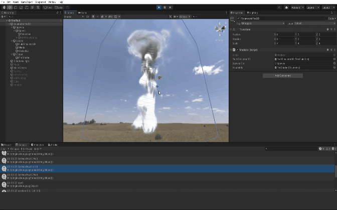

# Unity Volumetric Fire 3D
3D volumetric fire on Unity. This is under construction now.
https://vimeo.com/user90335829

## Env

- Windows 10
- RTX 3070

## References

- Scrawk, The GPU Gems 3D fluid simulation, https://github.com/Scrawk/GPU-GEMS-3D-Fluid-Simulation 
- Sebastian Lague, Clouds, https://github.com/SebLague/Clouds
- Mattatz, Unity-voxel, https://github.com/mattatz/unity-voxel
- Adam Samson, clouds, https://twitter.com/adamshmamshon/status/1266104960326012934
